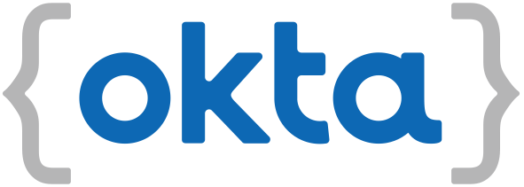

[](https://devforum.okta.com/)
[](https://search.maven.org/#search%7Cga%7C1%7Cg%3A%22com.okta.cli%22%20a%3A%22okta-cli%22)
[](https://opensource.org/licenses/Apache-2.0)

Okta CLI
========

The Okta CLI is the easiest way to get started with Okta! 

If you are a Java developer using Apache Maven, also checkout the [Okta Maven Plugin](https://github.com/oktadeveloper/okta-maven-plugin). 

## Installation

**macOS (via [Homebrew](https://brew.sh/)):**

```bash
brew install --cask oktadeveloper/tap/okta
```

To update to a new version:

```
brew reinstall okta
```

If you have issues getting the latest version, try untap and `brew install` again:

```
brew untap oktadeveloper/tap
```

**Linux (via Flatpak):**

```bash
# Add Flathub repo
flatpak remote-add --if-not-exists flathub https://flathub.org/repo/flathub.flatpakrepo

# install the package
flatpak install flathub com.okta.developer.CLI

# add this to your appropriate dot file
alias okta="flatpak run com.okta.developer.CLI"
```

**Linux and macOS:**

```bash
curl https://raw.githubusercontent.com/okta/okta-cli/master/cli/src/main/scripts/install.sh | bash
```

**Windows (via Chocolatey):**

```bash
choco install okta --version=0.8.0
```

**Manual Installs:**

Download the binary for your OS from the [releases](https://github.com/okta/okta-cli/releases) page. Manually install it to a directory on your PATH. 

## Usage

Run `okta --help` or `okta help <command>` for more details.

## Sign Up For a Free Okta Developer Account

Run `okta register` to sign up for a new account.  You will be prompted for your name and email address.  Account activation information will be emailed to you.

## Log Into an Existing Account

Configure the Okta CLI tool with an existing Okta account use `okta login` and follow the prompts.  

## Create an Okta Application (OAuth 2.0 / OIDC)

The Okta CLI tool can create Okta OAuth 2.0 / OIDC Applications for you with a few prompts. The following application types are supported:
- Web - Backend applications, Java, .Net, PHP, etc
- Single Page App (SPA) - Browser based applications
- Native App - desktop and mobile applications
- Service - Machine to Machine services

Run `okta apps create` and you will be prompted for the required information.

## Bash / Zsh Completion

If you have "bash-completion" installed run one of the following commands:

Linux

```sh
okta generate-completion > /etc/bash_completion.d/okta
```

Mac

```sh
okta generate-completion > /usr/local/etc/bash_completion.d/okta
```

If you are not using "bash-completion", copy the output of `okta generate-completion` to your desired location, and source the file from your `~/.bash_profile` script, for example:

```sh
okta generate-completion > ~/okta.bash
echo `. ~/okta.bash` >> ~/.bash_profile
```

For more details on using bash completion see the [Picocli documentation](https://picocli.info/autocomplete.html#_installing_completion_scripts_permanently_in_bashzsh).

## Contribute

The easiest way to build the project is to use [SDKMAN!](https://sdkman.io/)

If you have `sdkman_auto_env=true` in your `~/.sdkman/etc/config`, then when you switch to the project folder, the correct
JVM will be selected automatically.

You can also type: `sdk env` and the correct JVM will be used while in the project folder.

Install Native Image with: `gu install native-image`

Build with: `mvn clean install`

**NOTE:** On IntelliJ (at least), you'll also need to add in the Lombok plugin to avoid compiler errors on getters and setters for data classes.

You can then run the Okta cli with: `./cli/target/okta`
