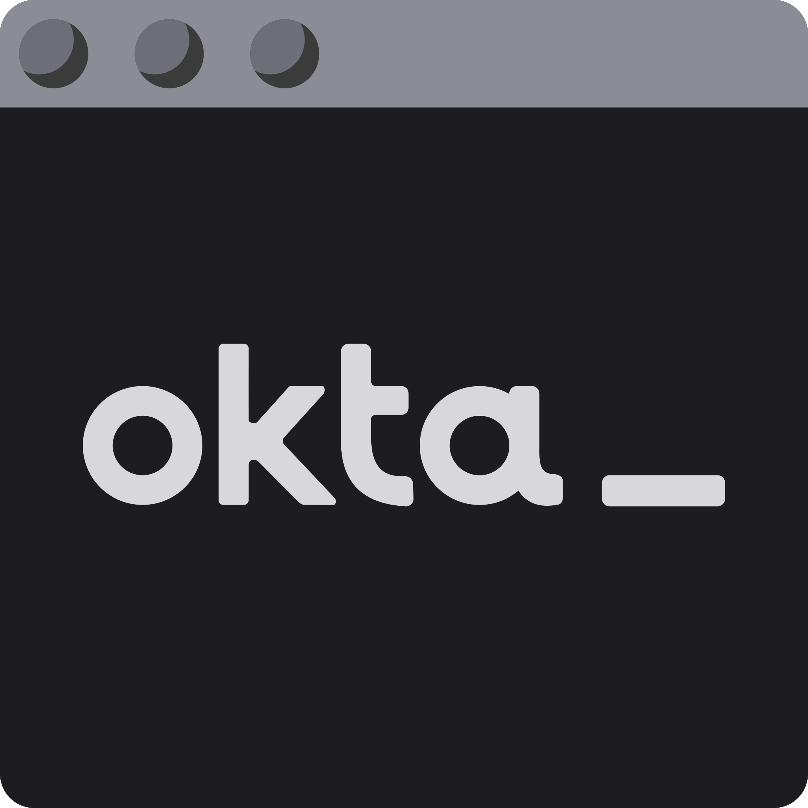

[](https://devforum.okta.com/)
[](https://search.maven.org/#search%7Cga%7C1%7Cg%3A%22com.okta.cli%22%20a%3A%22okta-cli%22)
[](https://opensource.org/licenses/Apache-2.0)

Okta CLI
========

The Okta CLI is the easiest way to get started with Okta! 

For Java developers using Apache Maven, there's the [Okta Maven Plugin](https://github.com/oktadev/okta-maven-plugin). 

<a href="https://foojay.io/today/works-with-openjdk">
   
</a>

## Install the CLI

Follow the directions for your platform to install the CLI. For more information on installing and using the CLI, see the [Okta CLI Documentation](https://cli.okta.com/).

### macOS Using [Homebrew](https://brew.sh/)

Run the following command in a terminal to install the CLI:

```bash
brew install --cask oktadeveloper/tap/okta
```

To update to a new CLI version:

```bash
brew reinstall okta
```

>**NOTE**
> 
>If you have issues installing the latest version, try removing the CLI using `brew untap` and then running `brew install` again:
>
>
> ```bash
> brew uninstall okta
> brew untap oktadeveloper/tap
> brew install --cask oktadeveloper/tap/okta
> ```

### Linux Using Flatpak
First add the Flathub repo if it's not already installed by running:

```bash
flatpak remote-add --if-not-exists flathub https://flathub.org/repo/flathub.flatpakrepo
```

Next, install the package:

```bash
flatpak install flathub com.okta.developer.CLI
```

Finally, add an alias to the command to the appropriate shell configuration ("dot") file:

```bash
alias okta="flatpak run com.okta.developer.CLI"
```

### Linux or macOS using curl

Run the following command in a terminal to install the CLI:

```bash
curl https://raw.githubusercontent.com/okta/okta-cli/master/cli/src/main/scripts/install.sh | bash
```

### Windows Using Chocolatey

Run the following command in a terminal to install the CLI:

```bash
choco install okta --version=0.10.0
```

### Manual Install

Open the [releases download page for the Okta CLI](https://github.com/okta/okta-cli/releases) and download the executable file for your OS. Move that file to the desired location in your system. If appropriate, add the directory to your shell `PATH` environment variable, or add an alias in to the executable in the appropriate shell configuration ("dot") file.


## Using the CLI

For general help run:

`okta --help`

For help on a specific command, run:
`okta help <command>`


### Sign Up For a Free Okta Developer Account

Run `okta register` to sign up for a new account. During the process you'll receive a verification code in a confirmation email sent from `noreply@okta.com`. If you don’t receive the email, check your spam folders.

Make a note of the Okta Domain that's shown after your account is created as you'll use this for logging in and when you create apps.

>**IMPORTANT**<br/> Set the password for your Okta developer organization by opening the link that’s shown after your domain is registered. Look for output similar to this:
>
```
Your Okta Domain: https://dev-xxxxxxx.okta.com
To set your password open this link:
https://dev-xxxxxxx.okta.com/welcome/xrqyNKPCZcvxL1ouKUoh
```


### Log Into an Existing Account

Run `okta login` to login to your developer Okta organization. You'll need the domain of the Okta organization domain and an access token.

> **NOTE**<br/> You are automatically logged in when you use `okta register` to create an account.

To generate an access token:

1. Log in to the admin console of your Okta organization.
1. Open Security > API.
1. Select the Tokens tab and then select Okta API.
1. Click Create Token and then enter a name for the new token.


### Create an OAuth 2.0 / OIDC Okta Application

Run the `okta apps create` command to create the Okta Application Integration for your single app. The CLI supports creating:

- **Web apps**: Backend applications using Java, .Net, PHP, etc.
- **Single page app (SPA)**: Browser based applications.
- **Native app**: Mobile and desktop application.
- **API service**: Machine to machine services.

You're prompted for the type of app and other required information. Note down the information shown after creating the integration as you'll need that for your app.


## Add Bash / Zsh Completion

The third party software "bash-completion" enables adding command completion for the Okta CLI. To add completion run the command for your platform. For more information on bash-completion, see [the providers documentation](https://picocli.info/autocomplete.html#_installing_completion_scripts_permanently_in_bashzsh).

### macOS

```sh
okta generate-completion > /usr/local/etc/bash_completion.d/okta
```

### Linux

```sh
okta generate-completion > /etc/bash_completion.d/okta
```

### Other

If you aren't using "bash-completion", copy the output of `okta generate-completion` to your desired location, and source the file from your `~/.bash_profile` script, for example:

```sh
okta generate-completion > ~/okta.bash
echo `. ~/okta.bash` >> ~/.bash_profile
```

## Contribute

Okta Command Line Interface is an [open project on GitHub](https://github.com/okta/okta-cli/blob/master). We invite you to download the source and propose changes.

### Build the Okta CLI

Build your local version of the Okta CLI using [SDKMAN!](https://sdkman.io/).

Set `sdkman_auto_env=true` in `~/.sdkman/etc/config` to select the correct JVM when you switch to the Okta CLI project folder.

Alternately, when you are in the project folder select the correct JDK by runing `sdk env`.

Run `mvn clean install` to build the CLI.

>**NOTE**<br/> To avoid IntelliJ compiler errors for data class `getter` and `setter`, add the Lombok plugin.


### Install and Run the CLI

Install your CLI build by running `gu install native-image`.

Run your build using `./cli/target/okta`.
